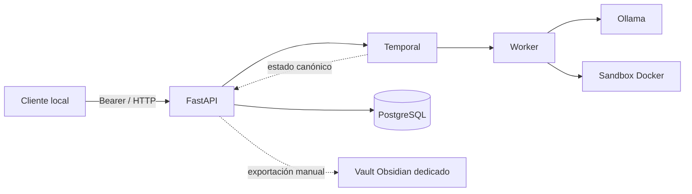

# Local Orchestra

Local Orchestra es un backend local para planificar trabajos, generar código y
pruebas independientes con modelos ejecutados por Ollama, probar el resultado en
un sandbox Docker y aplicar correcciones controladas. Está orientado a staging
local reproducible; todavía no incluye interfaz gráfica ni debe exponerse como
servicio público de producción.

## Capacidades actuales

- API FastAPI autenticada, validación estricta, idempotencia y rate limiting.
- Workflows Temporal recuperables, cancelables y con eventos consultables.
- Generación separada de fuente y pruebas; las pruebas permanecen inmutables.
- Ejecución de código no confiable únicamente en un sandbox Docker sin red.
- Ollama local con circuit breaker; adaptador Codex preparado y desactivado.
- PostgreSQL con memoria vectorial y checkpoints.
- Integración opcional con una bóveda Obsidian dedicada mediante Markdown.
- Health/readiness, métricas, logs estructurados, retención y runbook.

Estado: backend validado para staging local. No hay frontend, despliegue público,
TLS, alta disponibilidad ni soporte multiusuario distribuido.

## Arquitectura



Temporal y PostgreSQL son fuentes de verdad. Obsidian solo conserva conocimiento
y reportes humanos; nunca funciona como cola o base transaccional.

## Requisitos

Plataforma confirmada: Ubuntu 26.04 LTS, Python 3.14.4, Docker 29.7.2 y Git
2.53.0. Los paquetes Python bloqueados declaran Python 3.10 o posterior. Otras
versiones de Ubuntu deben validarse antes de usarse.

Estimación para el modelo local de 4B:

- Mínimo práctico: 4 núcleos, 16 GiB RAM y 30 GiB libres.
- Recomendado: 8 núcleos, 32 GiB RAM y SSD.
- GPU compatible con Ollama: opcional; mejora la latencia, no es obligatoria.

También se requieren Docker, PostgreSQL con pgvector, Temporal, Ollama y las
imágenes/modelos indicados en la guía de instalación.

## Inicio rápido

El repositorio debe permanecer privado. Cada persona autorizada crea su propia
instancia, datos y credenciales.

```bash
git clone URL_PRIVADA_DEL_REPOSITORIO /srv/local-orchestra/apps/orchestrator
cd /srv/local-orchestra/apps/orchestrator
python3 -m venv .venv
.venv/bin/python -m pip install -r requirements.lock
cp -n .env.example .env
ops/bin/orchestra-requirements --check
```

El inicio rápido no sustituye la preparación de Docker, PostgreSQL, Temporal,
Ollama, secretos y sandbox. Complete primero
[docs/INSTALLATION.md](docs/INSTALLATION.md).

## Documentación

- [Instalación](docs/INSTALLATION.md)
- [Configuración](docs/CONFIGURATION.md)
- [Resolución de problemas](docs/TROUBLESHOOTING.md)
- [Arquitectura](docs/ARCHITECTURE.md)
- [Contrato API](docs/API.md)
- [Seguridad](docs/SECURITY.md)
- [Operación y recuperación](docs/RUNBOOK.md)
- [Obsidian](docs/OBSIDIAN.md)

## Seguridad

- La API está cerrada por defecto y escucha solo en `127.0.0.1`.
- Nunca publique el token Bearer ni copie `.env` o `.secrets` entre equipos.
- Docker sin red, usuario no root y límites de recursos aíslan código generado.
- El repositorio compartido no contiene datos, credenciales ni la instancia del
  propietario.
- Obsidian debe usar un vault dedicado, nunca un vault personal.
- Exponer cualquier puerto a una red requiere otra fase de hardening, TLS,
  autenticación y revisión de amenazas.

## Limitaciones

- Staging local de una sola máquina; no producción pública.
- Rate limiting y métricas locales al proceso.
- Codex no está habilitado ni configurado.
- La búsqueda Obsidian es acotada y lineal; RAG local queda para una fase futura.
- Las unidades systemd son plantillas opcionales y no se instalan solas.
- Las descargas iniciales de paquetes, imágenes y modelos requieren red y deben
  realizarse explícitamente por el instalador.

## Licencia

Licencia pendiente. Hasta que exista un archivo `LICENSE`, el repositorio privado
no concede permisos generales de copia, redistribución o publicación. El acceso
debe limitarse a personas expresamente autorizadas.
